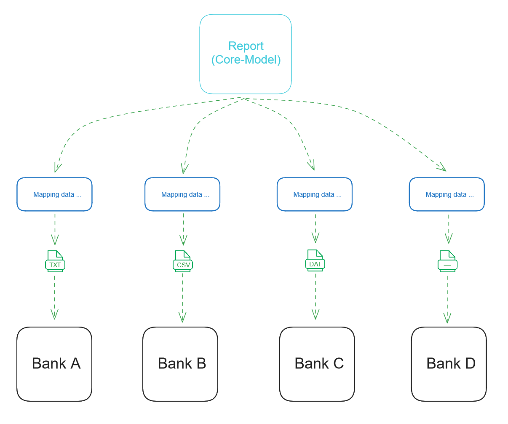
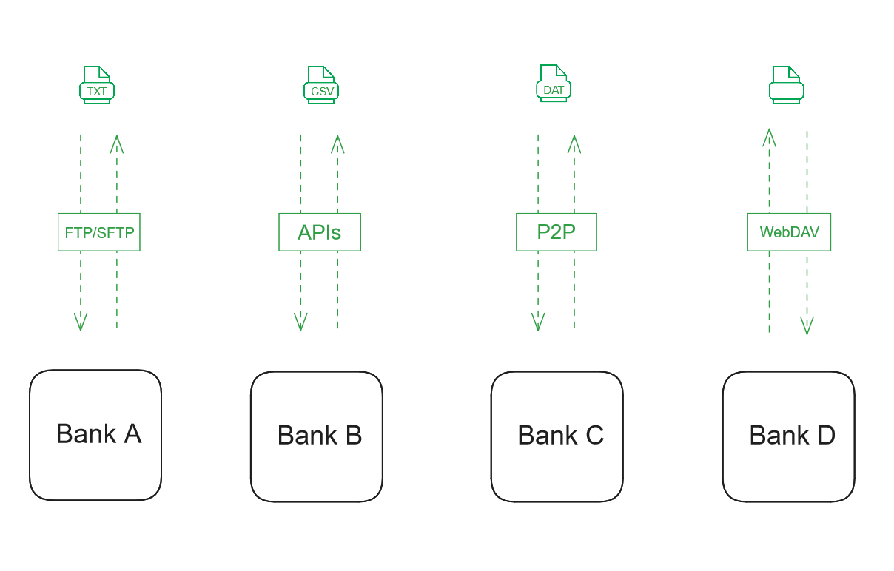
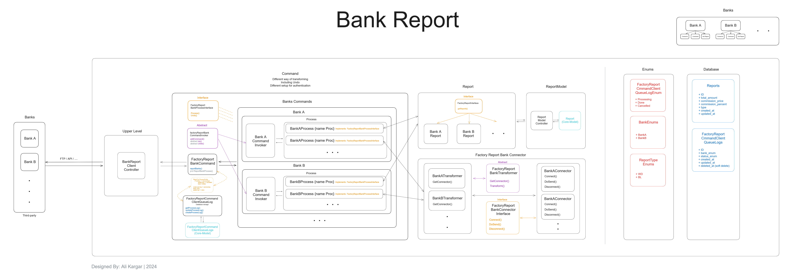
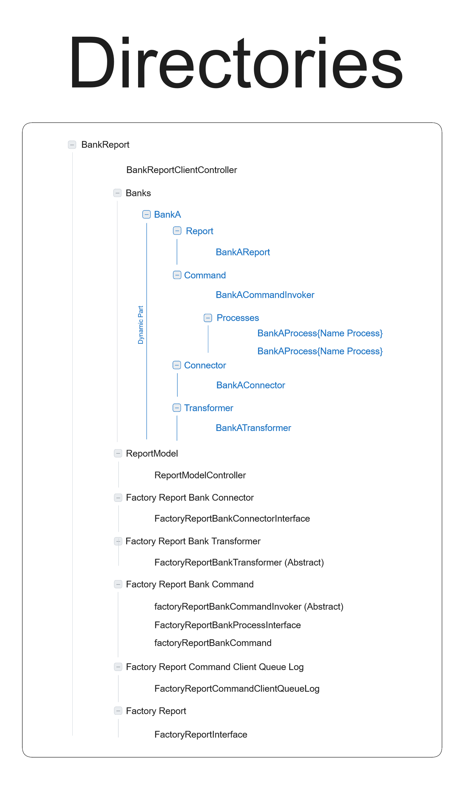

<h1>Bank Report using DesignPattern</h1>

**version**
1.0.0

**By**
Ali Kargar

Managing `various form of reporting` of some data for uploading on `various servers`

<h2>+ Explain the problem</h2>

Imagine we have a massive dataset that includes banking transactions, and our project involves several well-known banks. We need to prepare a series of reports and provide them to the banks for end-of-month reconciliation checks. Our database fields contain specific data that is separated by bank type. The issue is that each bank wants its own format, so we need to generate multiple versions of the same report.

Now, we need to consider that the data mappings are also completely different, and the authentication methods for uploading these files vary for each bank. Each bank might have its own preferred service, which could include FTP, file upload services, or anything else with any type of authentication.

In addition to all these issues, each report also requires its own cancellation processes. For example, if one of these reports fails, all reports need to be deleted and generated again from the beginning. There might also be specific tasks that need to be performed in case of failure.

<h2>+ Solution</h2>

To manage the reporting, processes specific to each bank, log checks for ongoing processes, and handle undo procedures in case of errors or job cancellations, we need to use certain design patterns. We can use commands, connectors, and factories to handle these processes.

Here is an overview of the general process:

<ul>
    <li><b>Commands</b>: These will handle the specific tasks required for each bank, including generating reports in different formats and managing data mappings.</li>
    <li><b>Connectors</b>: These will manage the different upload methods and authentication processes for each bank, such as FTP, file upload services, etc.</li>
    <li><b>Factories</b>: These will help create the necessary objects for each bank’s specific requirements, ensuring that each report is generated and uploaded according to the bank’s preferred method.</li>
</ul>

By using these patterns, we can streamline the process, ensure flexibility for different bank requirements, and handle errors more efficiently.

<h2>+ System Design</h2>

<h2>+ Directories</h2>

Additionally, the project directory will be structured so that adding a new bank won't require changes to the existing systems. You will only need to develop the specific configurations and processes for the new bank.

Here's the full approach:

<ul>
    <li>Commands: Handle specific tasks for each bank, such as report generation and data mapping.</li>
    <li>Connectors: Manage different upload methods and authentication processes for each bank.</li>
    <li>Factories: Create objects based on each bank’s requirements, ensuring proper report generation and uploading.</li>
    <li>Project Directory Structure: Organize the directory so that adding a new bank only involves developing new configurations and processes specific to that bank, without altering the existing system.</li>
</ul>

By following this approach, the system remains flexible and scalable, allowing for easy integration of new banks with minimal effort.

In this example, only a few configuration files and command scripts need to be added for each new bank. These files will set the necessary configurations for the bank, ensuring that the reporting operations include the new bank as well.

